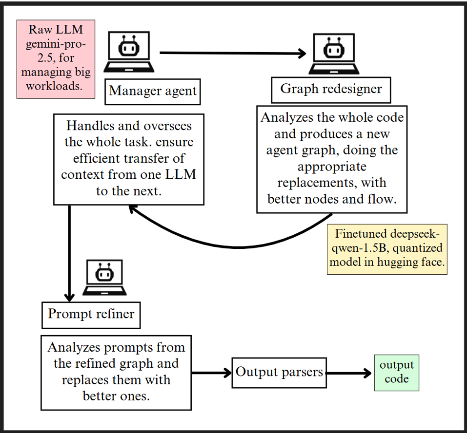

## Multi-Agent Pipelines for Prompt and Graph Refinement

This repository provides two modular, multi-agent pipeline designs aimed at improving prompt quality and agent graph configurations in LLM-based systems. Each pipeline is optimized for specific workloads, balancing performance, latency, and specialization across agents.

---

### 1. Prompt Refinement Pipeline

**Overview:**  
This pipeline is designed to extract, refine, and validate prompts from source code using a hierarchy of agents with varied capabilities. It enables effective delegation of tasks and ensures optimized prompts with minimal latency.

**Architecture:**

- **Manager Agent (DeepSeek-1.5B, Quantized):**  
  Oversees the entire task, specializes in code handling, extracts prompts from code, and delegates textual work to a lighter model.

- **Prompt Refiner (Mistral-Instruct-v03, Finetuned):**  
  Refines extracted prompts to generate clearer, higher-quality inputs. Operates with low latency on small textual segments.

- **Output Parser and Validator:**  
  Uses Pydantic models to validate the output and generate structured reports.

- **Diff Report Generator:**  
  Compares refined prompts and original inputs to identify meaningful changes.

- **Final Output:**  
  Validated, refined code or text artifacts ready for downstream use.
  
 

---

### 2. Agent-Graph Refinement Pipeline

**Overview:**  
This pipeline focuses on analyzing and reconstructing agent execution graphs, optimizing task flow and improving modularity across agents.

**Architecture:**

- **Manager Agent (Gemini-Pro-2.5, Raw):**  
  Handles the full workload and ensures seamless context transfer across agents.

- **Graph Redesigner (DeepSeek-Qwen-1.5B, Finetuned):**  
  Analyzes the entire codebase to redesign the agent graph with improved flow and node configuration.

- **Prompt Refiner:**  
  Reviews and replaces prompts from the updated graph to further optimize execution.

- **Output Parsers:**  
  Validate and process the final output based on the new agent structure.

- **Final Output:**  
  Code or task outputs generated from the refined and validated agent graph.

 

---

#### Notes

- All models used are either quantized for efficiency or finetuned for task specialization.
- The pipelines emphasize modular responsibility and minimize latency through lightweight agents.
- Finetuned models are gated on Hugging Face and used for specialized sub-tasks.
