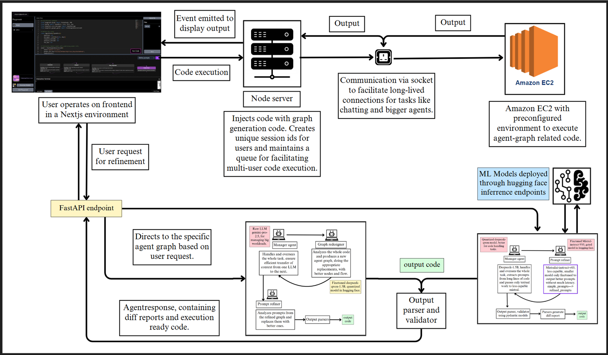

## Agent-Graph Execution & Refinement System

This system enables intelligent code refinement and agent-based transformation workflows through dynamic graph orchestration. It supports multi-user concurrency, persistent session handling, and external model inference for complex agent behavior.

### System Overview

The architecture is designed for modular, scalable execution of agent graphs where user-submitted code is refined, validated, and optionally restructured by specialized agents. Execution is managed through a centralized node server with support for live interaction and model-backed logic routing.

 

### Core Flow

1. **User Interaction**
   - Users interact via a Next.js frontend, submitting code and refinement requests.
   - Requests are sent to a FastAPI backend that routes them into agent workflows.

2. **Session Management**
   - A Node.js server handles session identification and queuing.
   - Each session is assigned a unique ID, enabling isolated execution contexts.
   - The server injects graph-specific metadata and manages lifecycle events for each user's job.
   - WebSocket channels are used for real-time interaction and maintaining long-lived connections.

3. **Agent Graph Routing**
   - The FastAPI service determines the appropriate agent graph based on user intent.
   - Two types of graphs are available:
     - **Prompt Refinement Graph**: Uses model endpoints to revise and optimize prompts.
     - **Agent Graph Redesign**: Uses a layout planner to restructure agent graphs dynamically.

4. **Execution Environment**
   - Amazon EC2 is used for executing agent pipelines in an isolated and scalable environment.
   - All agent-related code is executed remotely, with outputs returned via socket.

5. **Model Invocation**
   - All LLMs are deployed through Hugging Face inference endpoints.
   - The system supports multiple models (e.g., DeepSeek, Mistral, Gemini) and dynamically chooses which to invoke based on task complexity and agent graph configuration.

6. **Output Processing**
   - Once execution completes, responses are parsed and validated.
   - Output includes:
     - Refined code
     - Diff reports (if applicable)
     - Updated graph structure (in redesign mode)

7. **Feedback Loop**
   - Output is streamed back to the frontend.
   - Users can request iterative refinement, triggering recursive graph calls via retained session context.

## Highlights

- Session-aware architecture with real-time output delivery.
- Graph-driven execution control for multi-agent orchestration.
- Dynamic selection of model endpoints based on graph requirements.
- Decoupled backend execution for scalability and isolation.

## Deployment Notes

- EC2 environments must be preconfigured with all model clients and agent utilities.
- All communication between the frontend, node server, and EC2 must be secured and socket-enabled.
- Sessions should be pruned based on inactivity or TTL to maintain performance.

